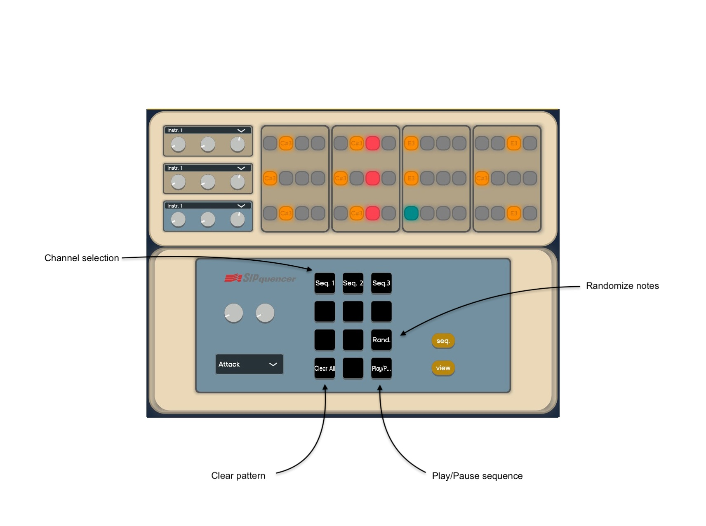
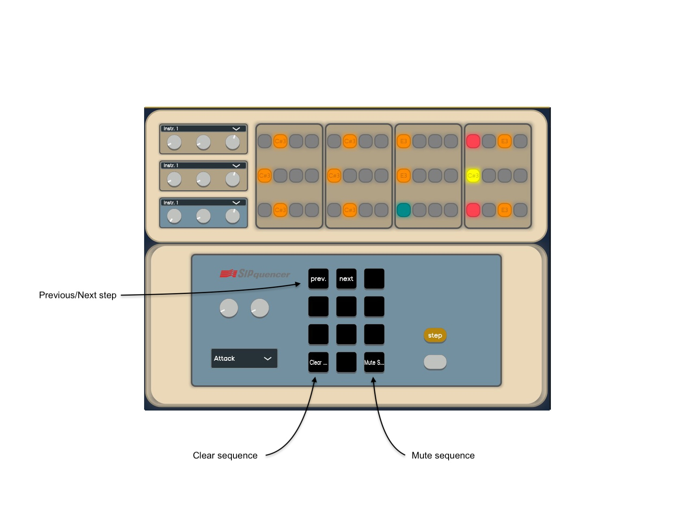

# SIPquencer: ReadMe

[Video Demo](https://youtu.be/siliA0u4QeY) 

## Aim and Overall Structure

The aim of this project is to convert an old telephone into a functional computer music system while retaining its original keypad, handset, and circuits. By utilizing the original vintage hardware to interface with modern digital audio tools, this project merges analog interaction with digital music synthesis and generative art. The system functions as a sequencer capable of handling three different sequences and offers the functionality of a traditional MIDI keyboard. Both synth and drum sounds are available for music creation. Through the GUI, users can tweak sounds and effect parameters, and the handset can be used to modulate these parameters, making live performances more interactive.

## Signal Processing Workflow

### Arduino to MIDI Conversion

The Arduino receives serial input from the keypad, translating these inputs into MIDI signals. Each key press corresponds to a specific MIDI note, control change, or program change. MIDI messages are sent on four different channels, with the first channel reserved for using the hardware as a classic keyboard.

### MIDI to OSC Conversion with JUCE

The MIDI signals generated by the Arduino are sent to a VST developed with JUCE. JUCE converts these MIDI signals into OSC (Open Sound Control) messages for communication between various multimedia devices. A GUI in JUCE supports the user and helps navigate all the SIPquencer functionalities. JUCE opens an OSC communication channel, converting MIDI messages into OSC messages, and allows users to change sound and effects parameters. This approach ensures smoother communication within the user's computer, avoiding the complexity of setting up MIDI buses.

### Synthesis in SuperCollider

SuperCollider receives OSC messages from JUCE and performs sound synthesis and effects. OSC messages trigger sounds (NoteOn, NoteOff) for both sequences and keyboards, and modulate sound parameters and effects (Attack, Decay, Release, Reverb, Delay).

### Generative Art with Processing

Processing receives OSC messages and generates visual art based on the note number and control parameters embedded in the OSC messages. The generative art dynamically changes in response to the musical input, providing a visual representation of the music being played.

## Hardware Configuration: Arduino

To accommodate the Arduino board, a portion of the telephone circuitry was desoldered, but the functionality of the original keypad was maintained. Each button on the keypad is represented by the intersection of a row and a column, each tied to specific digital input pins. A 4x4 keypad matrix is used, with each button corresponding to a unique pair of a row and a column. This setup allows efficient reading of inputs from the keypad and mapping each button press to a specific function or MIDI command.

### Serial to MIDI Conversion

The Arduino to MIDI conversion involves several key components and steps. The keypad setup is configured using a 4x4 matrix defined with specific pins and keys, managed by the Keypad library. The system operates as a finite state machine (FSM) to handle different states of key interactions. The sequencer is configured with four tracks, steps, note lengths, velocities, and other parameters. MIDI configuration follows, setting up the MIDI channel and standard MIDI message definitions. MIDI conversion is performed directly on the Arduino, allowing the device to be used directly in any DAW without needing a VST for MIDI to serial conversion.

### Gyroscope Implementation

The MPU6050 sensor is integrated to control sound parameters based on the orientation of the telephone’s handset. The “MPU6050_light” Arduino library is used to interface with the sensor, initializing I2C communication and calculating coordinate offsets. Sensor data is processed and mapped to MIDI protocol messages, allowing real-time modulation of MIDI parameters during sequence playback.

## JUCE: OSC Handling and User Interface

In JUCE, a GUI is crafted to optimize performance by refreshing only the parts affected by modifications, minimizing computational power and time required for rendering. JUCE handles MIDI data conversion to OSC, enabling SuperCollider to receive OSC messages for real-time control over synths and parameters.

## SuperCollider: Sound Synthesis and Effects

Various synthesizers with distinct timbres and characteristics are crafted for this system, sharing common modulation parameters like attack, release, and cutoff. This design allows users to modulate these parameters seamlessly across all synthesizers. Reverb and delay effects enhance the synth sounds, with parameters chosen to enrich sounds with various presets. Audio buses route audio signals efficiently, and the effects operate in parallel. The `PolyphonicSynthManager` class manages polyphonic synthesis and dynamic note management.

### OSC Messages Receiving and Sending

SuperCollider both receives OSC messages from JUCE and forwards them to Processing. Note On, Note Off, Control, and Program changes listeners are instantiated in the main.scd file. SuperCollider handles up to four channels, facilitating real-time adjustments of synth parameters and program changes.

## Processing: Generative Art

Processing uses OSC messages to dynamically generate visual patterns. Upon receiving an OSC message, the oscEvent function processes it according to the address pattern ("/NoteOn" or "/Control"). During the drawing phase, shapes are drawn for each channel based on the current channel note and parameters such as attack, decay, cutoff, reverb, and delay. The generative art dynamically reflects the musical input, creating an interactive visual experience.

By integrating these components, this project combines vintage telephone hardware with contemporary digital music and art technologies, creating an innovative and interactive computer music system.

## How to use:

• MIDI controller Mode: play notes by pressing the keypad buttons and set
parameters by tuning the knobs on the GUI.
Standard view:

 
 • Sequencer mode: Enter in sequencer mode by pressing the two gray buttons. Select one of the three channels, press Rand to setup a random sequence, or the
view button to setup a custom one.
Sequencer view:

 
Sequencer view - “view” button pressed:

 
